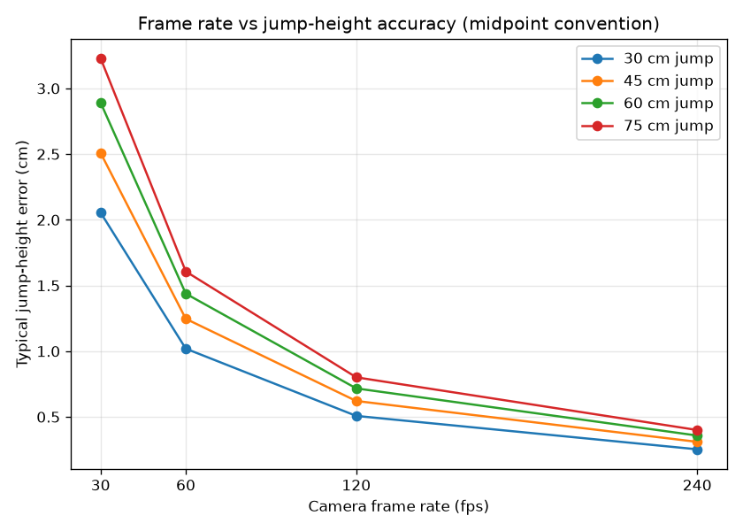

# Validation & error analysis

How accurate are sideOut's numbers, and where do they break? This document is
deliberately skeptical — the goal is for a reviewer to trust the numbers *or*
fairly judge them, not to oversell.

The headline metric is **jump height**, computed with the flight-time method:

```
h = g · t² / 8        (g = 9.80665 m/s², t = airtime in seconds)
```

Three things determine how good that number is: (1) is the flight-time method
itself valid, (2) how precisely can we measure airtime, and (3) how good is the
pose/event detection. We take them in turn.

---

## 1. Is the flight-time method valid?

The flight-time (FT) method is a long-established way to estimate vertical jump
height and is the same physics used by widely validated tools:

- **Bosco, Luhtanen & Komi (1983)** introduced the FT method for jump power. [1]
- **Balsalobre-Fernández, Glaister & Lockey (2015)** validated a *video*
  flight-time app (MyJump — the same measurement principle sideOut uses)
  against a force platform and reported near-perfect agreement
  (intraclass correlation ≈ 0.99). [2] This is strong support that a careful
  video flight-time pipeline can match lab equipment.

**The one systematic caveat, stated plainly.** FT assumes the body's centre of
mass is at the *same height at takeoff and landing*. If an athlete lands more
flexed (knees/ankles bent) than they took off, airtime is slightly inflated and
FT **overestimates** height. Force-plate *impulse–momentum* methods avoid this
by measuring takeoff velocity directly (see **Linthorne 2001** [3]). sideOut,
being camera-only, cannot; this is disclosed in the README limitations.

> **Takeaway:** the method is valid and well-supported for video, with one known
> upward bias when landing posture differs from takeoff. Exact effect sizes vary
> by study and population — confirm against the cited sources for your use case.

---

## 2. How precisely can we measure airtime? (frame-rate sensitivity)

A camera locates takeoff and landing only to within a frame, so airtime carries
a quantization error. sideOut places each event at the **midpoint** between the
last grounded and first airborne frame, which halves the typical error to about
half a frame period. Propagating that through `h = g·t²/8` (no data collection —
pure math, see [`validation/fps_sensitivity.py`](validation/fps_sensitivity.py)):

**Typical jump-height error (cm), midpoint convention (~0.5 frame):**

| True height | 30 fps | 60 fps | 120 fps | 240 fps |
|-------------|:------:|:------:|:-------:|:-------:|
| 30 cm | 2.06 | 1.02 | 0.51 | 0.25 |
| 45 cm | 2.51 | 1.25 | 0.62 | 0.31 |
| 60 cm | 2.89 | 1.44 | 0.72 | 0.36 |
| 75 cm | 3.23 | 1.61 | 0.80 | 0.40 |



**Reading this:** at a phone's default **30 fps**, a strong 60 cm jump has ~3 cm
of unavoidable timing error; at **60 fps** it halves to ~1.4 cm; at **120 fps+**
it is sub-centimetre. This is *why the capture protocol recommends 60 fps or
higher.* Error grows with jump height (longer airtime, steeper `dh/dt`).

Regenerate the table and plot:

```bash
uv run python validation/fps_sensitivity.py
```

---

## 3. How good is the event/pose detection?

Because we can't put a force plate under every clip, the detection engine is
validated against **synthetic jumps with known ground truth**
([`tests/fixtures.py`](tests/fixtures.py)): physically-consistent ballistic
trajectories with a known flight time, depth, and approach speed. The test
suite asserts the pipeline *recovers* those values, not merely that it runs:

- **Flight time / jump height:** recovered within ≈ ±0.06 s / ±4 cm across a
  0.30–0.70 s flight-time sweep (`tests/test_events.py`, `test_metrics.py`).
- **Countermovement depth:** within ≈ ±3 cm.
- **Loading time:** within ≈ ±0.12 s. **Arm-swing timing:** within ≈ ±0.06 s.
- **Edge cases covered:** no jump, multiple jumps, missing frames mid-flight,
  measurement noise, jumps clipped by the video edge, and a running approach
  with alternating planted feet.

These tolerances are the engine's error floor on *clean* input. On real footage,
pose noise and (crucially) tracking the correct athlete dominate — see below.

---

## 4. Real-world error budget (honest summary)

Total error on a real clip is the combination of:

| Source | Typical size | Mitigation |
|--------|--------------|------------|
| Frame-rate quantization | ~1–3 cm @ 30 fps; <1 cm @ 120 fps | Film at 60 fps+ |
| Flight-time posture assumption | upward bias, a few cm | Consistent takeoff/landing posture |
| Event detection (clean input) | ≤ ±4 cm (tested) | — |
| Height calibration | scales all metric-in-meters | Clean standing pose, accurate `--height-cm` |
| **Wrong-athlete tracking** | **can be total** | **Single dominant athlete in frame** |

The largest real-world risk is not the physics — it is monocular pose estimation
locking onto the wrong person in crowded footage. That is a data-quality
problem, addressed by the capture protocol, not a flaw in the metrics.

---

## References

1. Bosco C, Luhtanen P, Komi PV. *A simple method for measurement of mechanical power in jumping.* Eur J Appl Physiol Occup Physiol. 1983;50(2):273–282.
2. Balsalobre-Fernández C, Glaister M, Lockey RA. *The validity and reliability of an iPhone app for measuring vertical jump performance.* J Sports Sci. 2015;33(15):1574–1579.
3. Linthorne NP. *Analysis of standing vertical jumps using a force platform.* Am J Phys. 2001;69(11):1198–1204.

*Effect sizes cited above summarize the referenced studies; verify against the
primary sources before quoting specific figures.*
